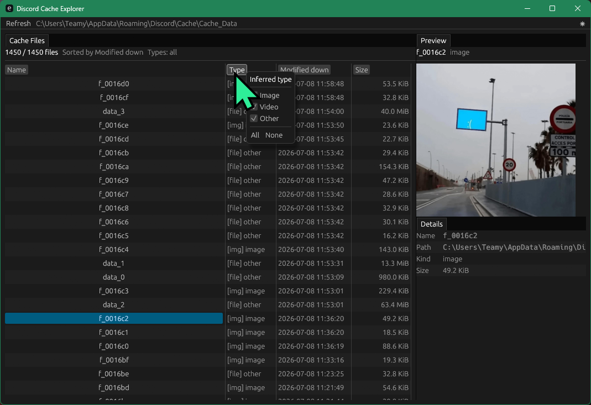

# Discord Cache Explorer

A Rust `egui` desktop tool for visually exploring Discord's local cache files.

Discord cache entries use mangled names and often have no file extension. This
tool scans the cache, infers basic media types from file contents, and provides
a sortable/filterable UI for finding images and videos worth saving elsewhere.



## Features

- Scans `%APPDATA%\Discord\Cache\Cache_Data` by default.
- Sortable table by name, inferred type, modified date, and size.
- Right-click type filter for image, video, and other files.
- Image preview for extensionless cache files.
- Video thumbnail extraction through `ffmpeg`.
- Headless CLI commands for cache inspection and verification.

## Usage

Launch the GUI:

```powershell
cargo run
```

Scan a different cache directory:

```powershell
cargo run -- gui --cache-dir "C:\path\to\Cache_Data"
```

List detected cache entries:

```powershell
cargo run -- list --limit 50
```

Inspect one file:

```powershell
cargo run -- inspect "C:\Users\Teamy\AppData\Roaming\Discord\Cache\Cache_Data\f_0016b9"
```

Extract a video thumbnail:

```powershell
cargo run -- thumbnail "C:\Users\Teamy\AppData\Roaming\Discord\Cache\Cache_Data\f_0016b9"
```

## Notes

Some embedded media, such as proxied Twitter/X videos, may be served from
Discord's remote media proxy or represented in Chromium cache metadata instead
of appearing as a complete local MP4 file. The current app is focused on local
cache bodies; URL metadata extraction is a likely next step.
